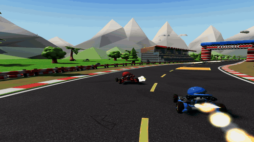
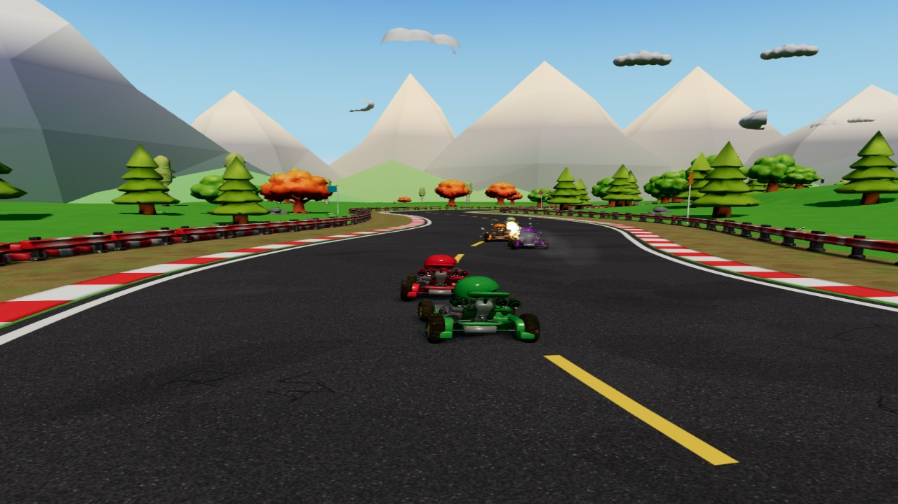
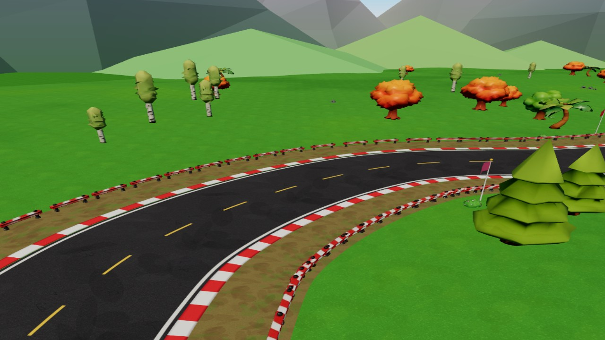
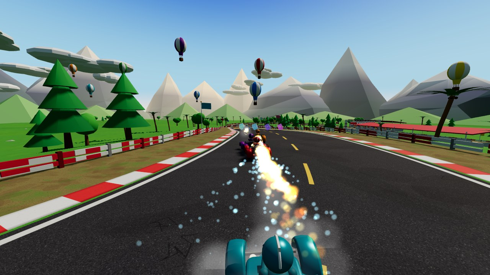
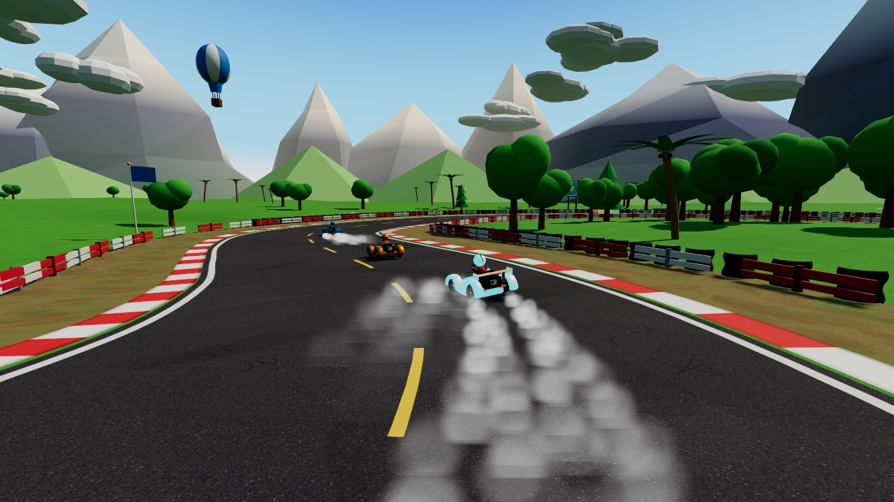

<div align="center">

# 🏎️ Turbo Kart Grand Prix

**A Mario Kart–inspired 3D kart racer built with Three.js. Every asset is procedural.**

### [▶ Play it live](https://turbo-kart-grand-prix.vercel.app)

<a href="docs/demo.mp4"></a>

<sub>Gameplay demo — <a href="docs/demo.mp4">watch the full 34-second capture with sound</a></sub>

*Built by **Claude Fable 5.1** in a single shot — one prompt, zero hand-written code, no external assets.*

</div>

---

## The prompt

This is the entire brief the model received (in [Claude Code](https://claude.com/claude-code), model `claude-fable-5-1`). Everything in this repository came from it:

> Launch four different Fable 5.1 sub-agents and coordinate them to build a polished, AAA-style kart racing game using Three.js. Make it inspired by Mario Kart. Make the assets real and amazing. Work autonomously without asking me questions, test the game thoroughly, and report back once a playable version is complete.

## How it was built

The lead agent wrote an architecture contract ([docs/ARCHITECTURE.md](docs/ARCHITECTURE.md)), then ran four Fable 5.1 sub-agents in parallel:

| Sub-agent | Delivered |
|---|---|
| **Track & environment** | 1.2 km circuit with hill, hairpin and chicane; textured road, curbs, barriers, boost pads, grandstands, trees, mountains, lake, balloons; sky, sun shadows, fog, clouds |
| **Vehicle** | Procedural kart model with driver, MK8-style physics: hop → drift → 3-tier mini-turbo, boosts, spin-outs, walls, off-road; keyboard + gamepad input |
| **Gameplay systems** | Item boxes & roulette, 8 items (shells home, bombs walk, lightning shrinks), AI racers that drift, dodge and rubber-band, pooled particle effects |
| **Presentation & loop** | HUD with minimap and speedometer, menu, countdown, results; WebAudio engine/SFX/chiptune music; fixed-step simulation, lap logic, chase camera |

The lead then integrated the modules, drove the game headlessly (deterministic frame stepping, synthetic input, full 8-kart races), fixed what it found, tuned the drift feel and deployed.

## Features

- 3-lap races against 7 AI opponents, position-weighted items, boost pads, drift mini-turbos
- Mushroom, triple mushroom, banana, green shell, red (homing) shell, super star, lightning, bob-omb
- Fully procedural world: canvas-painted textures, instanced scenery, ~480k triangles in ~200 draw calls
- Synthesised audio: speed-tracking engine, 20 sound effects, looping chiptune
- Runs from a single `index.html` — no bundler, no build step, Three.js r160 via import map

## Controls

| Action | Keyboard | Gamepad |
|---|---|---|
| Accelerate | `W` / `↑` | `A` / RT |
| Brake / reverse | `S` / `↓` | `B` / LT |
| Steer | `A` `D` / `←` `→` | Left stick |
| Hop / drift *(hold for blue → orange → pink turbo)* | `Shift` / `Space` | RB / LB |
| Use item | `Ctrl` / `E` / `Enter` | `X` / `Y` |
| Look back | `Q` | Back |
| Pause | `P` / `Esc` | Start |
| Restart | `R` | — |

## Run locally

```bash
git clone https://github.com/Franklin-C/turbo-kart-grand-prix.git
cd turbo-kart-grand-prix
npm start          # → http://localhost:5173
```

Any static server works; the game only needs to be served over HTTP (ES modules don't load from `file://`).

Headless tests (physics sim, items/AI sim, track geometry, audio and HUD smoke):

```bash
npm run test:setup   # installs three + jsdom locally, nothing is saved to package.json
npm test
```

## Layout

```
index.html / styles.css   page + UI styling
src/main.js               state machine, fixed-step sim, laps, camera, wiring
src/track.js              circuit, road lookup, scenery
src/environment.js        sky, lighting, fog, clouds
src/kart.js               kart model + driving physics
src/input.js              keyboard & gamepad
src/ai.js                 opponent driving and item use
src/items.js              item boxes, projectiles, hazards
src/particles.js          pooled point-sprite effects
src/audio.js              WebAudio synth
src/hud.js                DOM HUD, minimap, menus
tests/                    Node test harnesses
docs/                     architecture contract, screenshots, demo video
```

<div align="center">
   
</div>
